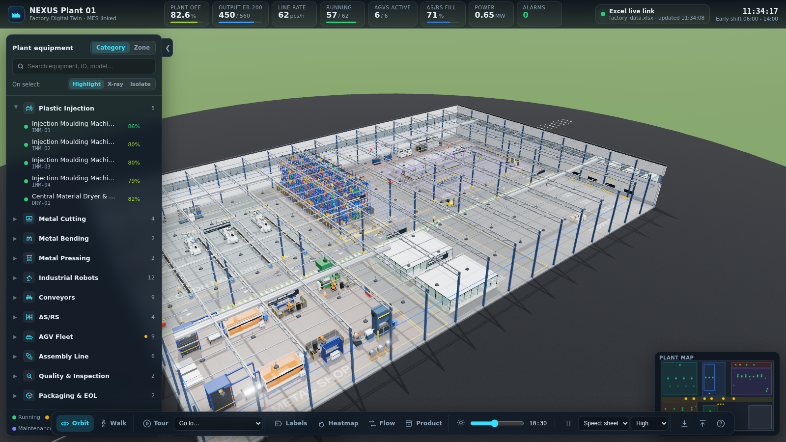
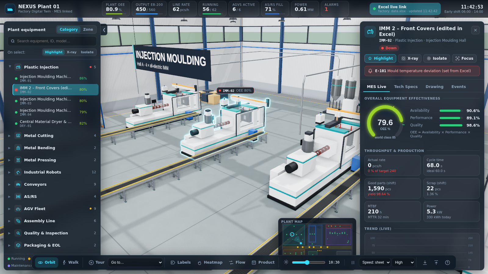

# NEXUS Plant 01 – 3D Factory Digital Twin (three.js)

An interactive, browser-based **digital twin of a highly automated factory** built with three.js.
It produces the (fictional) **EB-200 Smart Electrical Enclosure** from plastic and sheet-metal
parts all the way to wrapped pallets on the shipping dock. Every machine is animated, selectable,
has made-up technical specs and a generated technical drawing, and shows **live MES data
(OEE, throughput, counts, alarms) that is driven by an Excel workbook you can edit while the twin
is running.**





## Quick start

```bash
npm install
npm start            # → http://localhost:5173
```

Open `data/factory_data.xlsx` in Excel (or LibreOffice), change a yellow cell – e.g. set
`IMM-02 → Status = Down` and type an alarm text – and **save**. The dev server detects the save and
pushes the new values to the browser over a WebSocket. The 3D view, tree, panels and alarms
update within about a second.

Other scripts:

| Command | Purpose |
| --- | --- |
| `npm run build` | Static build in `dist/` (the workbook is snapshotted into the bundle) |
| `npm run preview` | Serve the static build locally |
| `npm run generate-data -- --force` | Re-create `data/factory_data.xlsx` from `shared/catalog.js` (overwrites your edits) |

`FACTORY_XLSX=/path/to/other.xlsx npm start` points the live link at another workbook.

## What's in the plant

| Area | Equipment (62 items) |
| --- | --- |
| **Injection Moulding Hall** | 4 all-electric IMMs (350 t / 500 t) with animated toggle clamp, injection unit, heater bands; 4 Cartesian take-out robots; 4 outfeed belt conveyors with tote filling; central dryer with conveying lines |
| **Sheet Metal Shop** | 2 fiber lasers (moving gantry, sparks, shuttle pallet exchange) with automatic sheet storage towers; 2 robot-tended CNC press brakes (the sheet visibly bends); 400 t hydraulic press with tending robot; 250 t servo press line with coil decoiler; 10 t bridge crane; roller outfeed conveyor |
| **Central AS/RS** | 3-aisle high-bay rack (1188 tote locations, instanced), 3 stacker cranes with telescopic forks that store and retrieve totes, pick & drop conveyors |
| **Logistics** | 5 roller-top AMRs + 1 autonomous forklift on a routed aisle network (right-hand lanes, filleted corners, collision avoidance, battery management), 3 charging stations |
| **Assembly Hall** | Twin-belt pallet transfer loop with 16 RFID carriers; 7 stations: housing load robot, SCARA DIN-rail insertion, cover placement robot, 4-spindle screwdriving portal, vision tunnel (strobed lights, OK/NOK), cobot labelling + laser marking, unload & cartoning robot |
| **End of line** | Carton conveyor, palletizing robot (4 × 3 pattern), turntable stretch wrapper, forklift AGV to shipping lanes |
| **Quality / Control** | Bridge CMM in a glass metrology lab; control room with a live MES video wall |
| **Utilities** | 2 screw compressors, free-cooling chiller, transformer & switchgear |

The product flow is simulated end to end. Parts come off the IMM and press conveyors, AGVs carry
the totes into the AS/RS, cranes store them and retrieve kits, and AGVs deliver the kits to the
assembly infeed. The product grows visibly on the carriers station by station, then gets cartoned,
palletized and wrapped, and the forklift takes it to shipping.

## Using the twin

* **Navigate**: orbit (drag / right-drag / wheel), **Walk** mode (`F`: WASD + mouse, collision
  with machines), **guided tour** (`T`), *Go to…* menu, click on the minimap.
* **Equipment tree** (left): grouped by *Category* or *Zone*, with search, live status dots and OEE,
  and eye toggles. Clicking an item selects it and flies the camera to it.
* **Selection modes**: *Highlight* (glowing outline), *X-ray* (everything else ghosted) and
  *Isolate* (only the item is shown).
* **Info panel** (right) for the selected item:
  * **MES Live**: OEE gauge, availability / performance / quality, actual vs. target rate,
    cycle time, good / scrap counts, MTBF / MTTR, power & energy, live trend chart, work order and
    maintenance dates. AGVs also show mission, speed and battery.
  * **Tech Specs**: asset data and the full specification from the `Specs` sheet.
  * **Drawing**: a blueprint-style general-arrangement drawing (front / side / top / isometric
    views, overall dimensions, title block) rendered on the fly from the 3D model. It can be
    downloaded as a PNG.
  * **Events**: alarm history of the item.
* **Overlays**: floating labels (`L`), OEE heatmap (`H`), animated material-flow arrows (`M`),
  and the EB-200 routing & BOM panel (`P`).
* **Time of day** slider (sun, sky, stars, interior lighting), simulation pause / speed, and render
  quality (High = GTAO ambient occlusion + bloom + soft shadows).
* **Alarms drawer**: active alarms and history. Click an alarm to jump to the machine.

## The Excel / MES link

`data/factory_data.xlsx` has these sheets:

| Sheet | Content |
| --- | --- |
| `README` | How-to |
| `Settings` | Plant name, *Simulation Enabled*, *Simulation Speed*, *Random Event Rate*, shift text and target |
| `Equipment` | Master data (name, category, zone, manufacturer, model, serial, year, drawing no.) |
| `MES` | Status (drop-down), work order, part, **Availability / Performance / Quality %**, **OEE (formula)**, target / actual rate, ideal / actual cycle, good / scrap, MTBF, MTTR, power, energy, battery, operator, maintenance dates, active alarm code / text |
| `Specs` | One row per spec parameter: `ID, Group, Parameter, Value, Unit` |
| `Product BOM`, `Product Routing` | The EB-200 product-flow story |
| `Alarm Catalogue` | Alarm codes the simulation uses for random stops |

How the values affect the twin:

* **Status** stops or starts the machine animation and sets its stack light: green running,
  amber idle, blue maintenance, flashing red down. The tree, labels, heatmap and minimap follow.
  *Down* with an alarm text raises an alarm.
* **Actual Cycle** vs. **Ideal Cycle** changes the machine's animation speed.
* A/P/Q %, rates, counts, energy and battery appear immediately in the panels and KPIs.
* With *Simulation Enabled = Yes*, a live MES simulation runs on top of the sheet values: counters
  tick, KPIs fluctuate slightly, and random stops and alarms come from the alarm catalogue. Set it
  to *No* to freeze the twin exactly on the sheet values.

Columns are matched by header text, so you can reorder or extend the sheets. Only keep the `ID`
values intact, because they link the rows to the 3D objects.

## GitHub Pages

`.github/workflows/deploy-pages.yml` builds and deploys the static version on every push to `main`.
To turn it on, go to *Settings → Pages* and set *Source = GitHub Actions*. The static build has no
file watcher: it starts from the bundled workbook snapshot, and you can **drag & drop** an edited
`.xlsx` onto the page (or use the upload button) to apply it.

## Project structure

```
shared/catalog.js        plant layout, equipment master data, specs, MES baselines, routing, alarms
shared/parseWorkbook.js  Excel → JSON (used by the dev server, the build and in-browser import)
scripts/generate-excel.js  creates the formatted workbook (validation, formulas, conditional formats)
vite.config.js           "excel-live-link" plugin: file watcher + WebSocket push + static snapshot
src/core/                engine (renderer, post-processing, sky/time of day), navigation, selection, factory assembly
src/equipment/           procedural models + behaviour: IMM, sheet metal, robots (IK), AS/RS, AGVs, assembly, utilities
src/world/               building, procedural textures, materials, people, props, flow overlay
src/data/store.js        data link client + live MES simulation
src/ui/                  tree, info panel, drawings, charts, HUD (KPIs, toolbar, alarms, minimap, labels)
```

Everything is generated procedurally in code (geometry, textures, drawings), so there are no
external 3D assets. All manufacturers, models and specifications are fictional.
